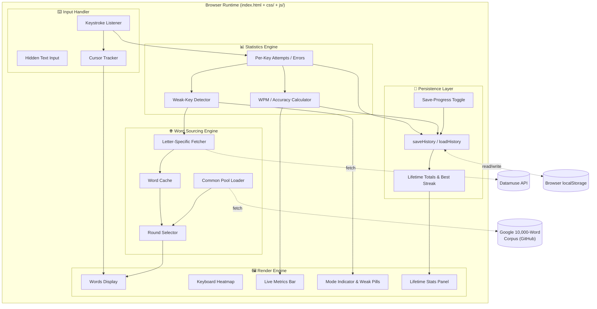
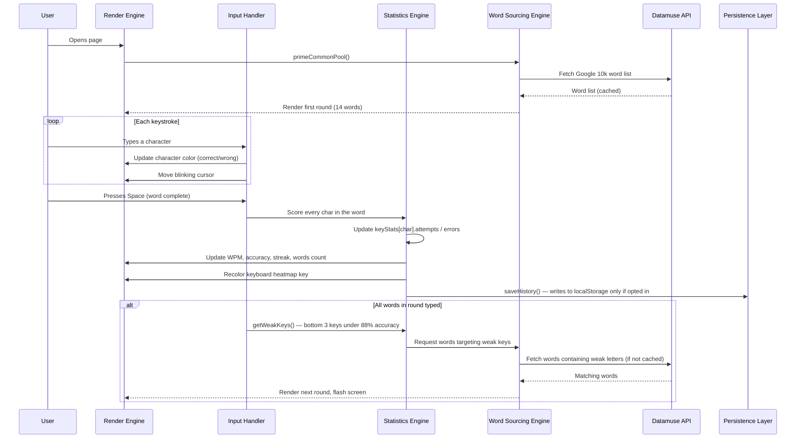
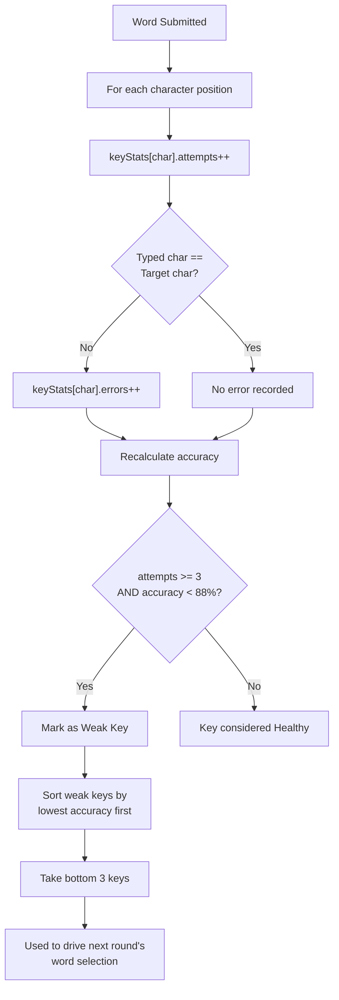
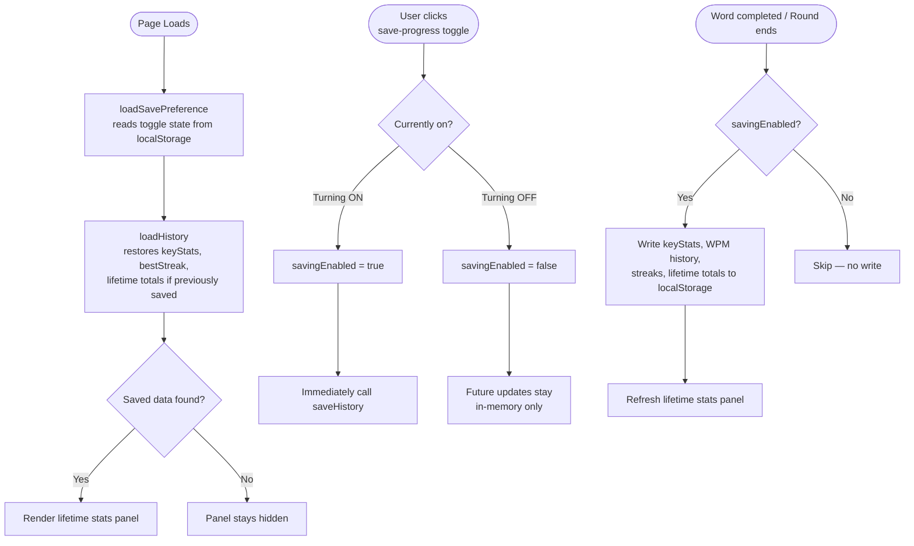
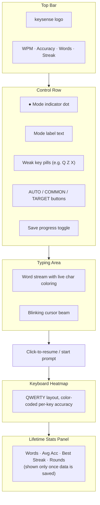

# ⌨️ keysense

**An adaptive typing trainer that learns where you struggle — and feeds you words to fix it.**

keysense is a lightweight, dependency-free typing practice tool that goes beyond static word lists. It tracks your accuracy on every key in real time, identifies your weakest keys, and automatically pulls real English words from a live dictionary API that are rich in those specific letters — turning every round into a targeted micro-drill. Progress can optionally be saved to your browser so your key-accuracy history, streaks, and stats persist across sessions.

---

## Table of Contents

1. [Overview](#1-overview)
2. [Key Features](#2-key-features)
3. [System Architecture](#3-system-architecture)
4. [How It Works](#4-how-it-works)
5. [Practice Modes](#5-practice-modes)
6. [The Weak-Key Detection Algorithm](#6-the-weak-key-detection-algorithm)
7. [Saved Progress & Lifetime Stats](#7-saved-progress-lifetime-stats)
8. [Data Sources](#8-data-sources)
9. [User Interface Guide](#9-user-interface-guide)
10. [Project Structure](#10-project-structure)
11. [Configuration](#11-configuration)
12. [Getting Started](#12-getting-started)
13. [Browser Compatibility](#13-browser-compatibility)
14. [Known Limitations](#14-known-limitations)
15. [Credits & License](#15-credits-license)

---

## 1. Overview

Most typing trainers show you a fixed paragraph or a randomized word list and call it a day. **keysense** instead treats your typing session like a feedback loop: it constantly measures per-key accuracy, decides which keys are dragging you down, and — instead of guessing — queries the **Datamuse API** for real words that contain those problem letters. The result is a practice set that is statistically biased toward your actual weaknesses, refreshed every round.

It is built as a small set of static files — **HTML, CSS, and modular JavaScript** — with no build step, no framework, and no backend. Everything — UI rendering, input handling, statistics, caching, API orchestration, and optional local persistence — runs in vanilla JavaScript directly in the browser.

---

## 2. Key Features

| Feature | Description |
|---|---|
| 🎯 **Adaptive targeting** | Continuously tracks accuracy per key and automatically rotates in words that exercise your three weakest keys. |
| 🔄 **Three practice modes** | `auto` (smart switching), `common` (frequency-based vocabulary), `target` (always drill weak keys). |
| 🌐 **Live word sourcing** | Fetches real, frequency-ranked English words from the Datamuse API and the Google 10,000-word corpus — no hardcoded word bank. |
| 🗺️ **Keyboard heatmap** | A QWERTY-shaped visual grid color-codes every letter by accuracy (great → good → ok → bad), pulsing red on problem keys. |
| 📊 **Live metrics** | Real-time WPM, accuracy %, words completed, and current correct-word streak, all updating per keystroke. |
| 💾 **Opt-in progress saving** | A toggle button lets you choose whether key accuracy, WPM history, best streak, and lifetime totals are saved to `localStorage` — off by default, fully under your control. |
| 📈 **Lifetime stats panel** | Once saving is enabled, a summary panel shows cumulative words typed, average accuracy, best-ever streak, and total rounds across all sessions, with a one-click reset. |
| ⚡ **Smart caching & prefetching** | Words for each letter are cached after first fetch and silently pre-warmed in the background so practice never stalls on a network call. |
| 🖱️ **Minimal, distraction-free UI** | A dark, monospace, terminal-inspired interface with subtle animations (cursor blink, flash-on-round, pulsing weak-key pills). |
| 📱 **No installation needed** | Pure HTML/CSS/JS — open `index.html` in any modern browser and start typing immediately. |
| 🧩 **Modular codebase** | Logic is split into focused, single-responsibility JavaScript modules instead of one large script, making the project easier to navigate and maintain. |

---

## 3. System Architecture

keysense is composed of five cooperating subsystems, each implemented as its own JavaScript module and loaded in dependency order by `index.html`: the **Render Engine**, the **Input Handler**, the **Statistics Engine**, the **Word Sourcing Engine**, and the **Persistence Layer**. They communicate through shared in-memory state (no global store or framework is used) — module separation is organizational, not architectural isolation.



**Design philosophy:** there is no server and no database. All "intelligence" — caching, scoring, and word selection — happens client-side, in memory, for the duration of the page session. Saved progress (key accuracy, streaks, lifetime totals) is the one exception: when explicitly enabled by the user, it survives in the browser's `localStorage` across reloads. Everything else resets when the tab is closed or refreshed.

---

## 4. How It Works

At a high level, every typing round follows the same loop: **select words → render them → capture keystrokes → score accuracy → decide the next round's focus.**



### Step-by-step breakdown

1. **Initialization** — On page load, keysense loads the user's save preference and any previously saved history (if present), then fetches the Google 10,000-word English corpus (filtered to clean, 3–9 letter words) and builds the first practice round from the most frequent 2,000 words.
2. **Typing capture** — Keystrokes are captured through an invisible, off-screen `<input>` element (so mobile keyboards and IME work correctly), and every character is reflected onto styled `<span>` elements in real time — green for correct, red for incorrect, with a blinking cursor beam.
3. **Per-word scoring** — When the user presses **Space**, the just-typed word is compared character-by-character against the target word. Each character updates a global `keyStats` map of `{ attempts, errors }` for that letter.
4. **Live metrics update** — WPM (using the standard 5-characters-per-word convention), accuracy percentage, words completed, and streak are recalculated after every word and reflected instantly in the header.
5. **Keyboard heatmap update** — The corresponding key on the on-screen QWERTY heatmap recolors based on rolling accuracy for that letter (green tiers for good, red/pulsing for poor).
6. **Round end & re-selection** — Once all words in the round are typed, keysense determines the next round's word pool based on the active **mode** (see below) and the current weakest keys, fetching new words from Datamuse if they aren't already cached.
7. **Background pre-fetching** — Independently of the round loop, keysense quietly pre-fetches word lists for *every* letter of the alphabet a few seconds after load, staggered to avoid hitting rate limits — so that by the time a key becomes "weak," its word pool is often already cached.
8. **Optional persistence** — If the user has enabled the **save progress** toggle, key accuracy, WPM/accuracy samples, best streak, and lifetime totals are written to `localStorage` after each word and at the end of every round, and the lifetime stats panel refreshes to reflect the update.

---

## 5. Practice Modes

keysense ships with three selectable modes, switchable instantly via the pill buttons in the top control bar.


| Mode | Behavior |
|---|---|
| **`auto`** *(default)* | Runs a brief warm-up using common words to establish a baseline, then automatically switches into targeting mode once weak keys are detected — alternating intelligently as needed. |
| **`common`** | Always draws from the general frequency-ranked vocabulary pool, ignoring weak-key data. Good for general practice or testing raw speed. |
| **`target`** | Always tries to drill your three weakest keys, pulling in common words only as a filler if there isn't yet enough weak-letter data. |

---

## 6. The Weak-Key Detection Algorithm

This is the analytical core of keysense. After every word, character-level results feed into a running accuracy table for all 26 letters.



**Key parameters** (defined at the top of the script, easily tunable):

- `WEAK_THRESHOLD = 0.88` — any key with accuracy below 88% is considered weak.
- `MIN_ATTEMPTS = 3` — a key needs at least 3 recorded keystrokes before it can be flagged, preventing one early typo from skewing results.
- The **3 weakest** keys (by lowest accuracy) are selected at any given time, shown as red pills next to the mode indicator (e.g. `Q`, `Z`, `X`).

The keyboard heatmap uses four accuracy tiers for visual feedback: **great** (≥96%), **good** (≥90%), **ok** (≥82%), and **bad** (<82%, with a subtle red pulse animation to draw attention).

---

## 7. Saved Progress & Lifetime Stats

By default, keysense keeps everything in memory only — closing the tab wipes your session. The **save progress** toggle in the top control bar lets you opt in to persisting your progress to the browser's `localStorage`, so it survives reloads and future visits.



**Key behaviors:**

- **Off by default** — nothing is written to `localStorage` until the user explicitly turns the toggle on; this is a deliberate, transparent opt-in rather than silent background tracking.
- **The toggle preference itself persists** independently (under a separate `localStorage` key) from the practice data, so your on/off choice is remembered across visits even before you've saved any progress.
- **Loading is always attempted** — if saved data exists from a previous session (because saving was on at some point), it is restored on page load and reflected in the keyboard heatmap and lifetime panel, *even if saving is currently switched off*. This lets you review old progress before deciding whether to resume saving.
- **Turning the toggle on mid-session** immediately persists whatever you've already typed in that session, not just future activity.
- **What gets saved**: per-key `attempts`/`errors` (the data behind the heatmap and weak-key detection), a capped rolling log of WPM/accuracy samples, your all-time best streak, and lifetime totals for words typed, characters typed, errors, and rounds completed.
- **Lifetime stats panel** — appears beneath the keyboard heatmap once there is saved data, showing four cumulative figures: total words typed, average accuracy, best-ever streak, and total rounds — with a **clear** action to wipe saved history on demand.
- **Save checkpoints** — a write to `localStorage` is attempted after every completed word, at the end of every round, and whenever the practice mode is switched (so your mode preference is captured alongside the rest of the saved payload).

---

## 8. Data Sources

keysense intentionally avoids any hardcoded, hand-picked word list — every word the user types is sourced live from real linguistic data.

| Source | Purpose | Fallback |
|---|---|---|
| **Google 10,000 English Words** (`first20hours/google-10000-english`, hosted on GitHub raw) | Supplies the general/common word pool, pre-sorted by real-world frequency. Filtered to clean alphabetic words between 3–9 characters. | If unreachable, falls back to Datamuse topic queries, then to a small embedded static list as a last resort. |
| **Datamuse API** (`api.datamuse.com`) | Supplies words that *start with* or *contain multiple occurrences of* a specific weak letter, used to build targeted practice rounds. Results are frequency-sorted using Datamuse's `f:` frequency tag. | Returns an empty array on failure; the round selector then backfills with the common pool so practice never breaks. |

All fetched word lists are cached in memory per letter (`wordCache`) to minimize redundant network calls, with each letter's cache holding up to 60 words.

---

## 9. User Interface Guide



- **Top bar** — Shows the keysense wordmark and four live metrics: **WPM**, **Accuracy**, **Words typed**, and **Streak** (consecutive correctly-typed words). High-performing metrics are highlighted in the accent color (lime green) once they cross a threshold (e.g. WPM > 40, accuracy > 95%, streak > 5).
- **Mode row** — A pulsing dot and label show the current internal state (`warming up`, `targeting`, `common words`, etc.), alongside red pill badges for any currently-detected weak keys.
- **Mode switcher** — Three buttons (`AUTO`, `COMMON`, `TARGET`) let the user manually override the practice strategy at any time; switching modes immediately reloads the round.
- **Save progress toggle** — A pill-shaped switch next to the mode buttons. Off by default; clicking it enables saving key accuracy, WPM history, streaks, and lifetime totals to `localStorage`, and the label updates to "saving progress" with a lime-accented switch.
- **Typing area** — Words wrap naturally across lines. Characters are colored dim (untyped), white (active), green (correct), or red (incorrect), with a blinking lime cursor beam tracking the current position.
- **Prompt line** — Displays contextual guidance ("click to begin," "click to resume") when the typing input loses focus.
- **Keyboard heatmap** — A miniature QWERTY layout beneath the typing area gives an always-visible, glanceable summary of per-letter accuracy across the whole session.
- **Lifetime stats panel** — Appears beneath the keyboard heatmap only once saved data exists, showing total words, average accuracy, best streak, and rounds completed across all sessions, with a "clear" link to reset saved history.
- **Flash overlay** — A very brief, subtle full-screen flash signals the transition between rounds.

---

## 10. Project Structure

keysense is organized as a small set of static files — no build pipeline, no package manager, no bundler. `index.html` is a slim entry point that links one stylesheet and loads thirteen single-responsibility JavaScript modules in dependency order.

```
keysense/
├── index.html              # Markup + <link>/<script> references — no inline CSS or JS
├── css/
│   └── styles.css          # Entire visual design system (colors, layout, animations)
└── js/
    ├── config.js            # Tunable constants + QWERTY keyboard layout
    ├── state.js              # In-memory session state + cached DOM references
    ├── word-source.js        # Datamuse fetcher + Google 10k corpus loader
    ├── keyboard-heatmap.js   # Heatmap build/update logic + getWeakKeys() algorithm
    ├── history-storage.js    # localStorage save/load, save-progress toggle, lifetime panel
    ├── word-selection.js     # pickWords() — mode-aware round builder + mode indicator UI
    ├── render.js              # Word/character DOM rendering + cursor positioning
    ├── input-handler.js       # Keystroke capture & live per-word scoring
    ├── metrics.js             # WPM / accuracy / streak calculation
    ├── round-manager.js       # endRound() round transitions + click-to-focus handling
    ├── utils.js               # Fisher-Yates shuffle
    ├── mode-switch.js         # switchMode() handler for the AUTO/COMMON/TARGET buttons
    └── init.js                # Bootstraps the app on page load
```

### Module responsibilities

| Module | Responsibility |
|---|---|
| `config.js` | Tunable constants (round size, thresholds, storage keys) and the QWERTY row definitions. |
| `state.js` | All mutable session state (`keyStats`, `words`, `curWord`, etc.) and cached `document.getElementById` lookups, declared once and shared by every other module. |
| `word-source.js` | Talks to the Datamuse API and the Google 10,000-word GitHub corpus; builds and caches per-letter word pools. |
| `keyboard-heatmap.js` | Renders and recolors the on-screen QWERTY heatmap; contains `getWeakKeys()`, the weak-key detection algorithm. |
| `history-storage.js` | Everything related to saved progress: the opt-in toggle, `saveHistory()` / `loadHistory()`, WPM history sampling, and the lifetime stats panel. |
| `word-selection.js` | `pickWords()` — decides the next round's word pool based on the active mode — plus the mode indicator / weak-pill UI updates. |
| `render.js` | Draws the current round's words and characters into the DOM and positions the blinking cursor. |
| `input-handler.js` | Listens to the hidden `<input>` element, colors characters live, and scores each completed word. |
| `metrics.js` | Recalculates WPM, accuracy, and streak after every word and updates the header display. |
| `round-manager.js` | Ends the current round, triggers the screen flash, requests the next round, and manages click-to-focus/blur behavior. |
| `utils.js` | Small shared helpers — currently the Fisher-Yates `shuffle()` function. |
| `mode-switch.js` | Handles `AUTO` / `COMMON` / `TARGET` button clicks and reloads the round in the newly selected mode. |
| `init.js` | Orchestrates startup: restores saved preferences/history, builds the keyboard, loads the word corpus, and renders the first round. |

### Load order matters

```mermaid
flowchart LR
    A[config.js] --> B[state.js]
    B --> C[word-source.js]
    C --> D[keyboard-heatmap.js]
    D --> E[history-storage.js]
    E --> F[word-selection.js]
    F --> G[render.js]
    G --> H[input-handler.js]
    H --> I[metrics.js]
    I --> J[round-manager.js]
    J --> K[utils.js]
    K --> L[mode-switch.js]
    L --> M[init.js]
```

The JavaScript modules are loaded as plain `<script src="…">` tags (not ES modules), executed top-to-bottom in the order shown above. This is intentional: several functions (`switchMode`, `toggleSaveProgress`, `clearSavedHistory`) are invoked directly from inline `onclick` attributes in the HTML, which requires them to remain plain global functions rather than scoped module exports. The dependency chain is straightforward — `config.js` and `state.js` must load first since every other module reads their constants and shared state, and `init.js` must load last since it calls functions defined in all the others.



---

## 11. Configuration

All tunable behavior lives in a single constants block at the top of `js/config.js` — no need to hunt through the codebase to adjust difficulty, pacing, or persistence behavior.

| Constant | Default | Effect |
|---|---|---|
| `WORDS_PER_ROUND` | `14` | Number of words presented per round. |
| `CACHE_PER_LETTER` | `60` | Max words cached per letter from Datamuse. |
| `WARMUP_ROUNDS` | `1` | Rounds of common-word practice before `auto` mode starts targeting weak keys. |
| `WEAK_THRESHOLD` | `0.88` | Accuracy cutoff below which a key is considered "weak" (88%). |
| `MIN_ATTEMPTS` | `3` | Minimum keystrokes on a key before it can be evaluated for weakness. |
| `STORAGE_KEY` | `'keysense-history-v1'` | `localStorage` key under which saved progress (key accuracy, streaks, lifetime totals) is stored. |
| `SAVE_PREF_KEY` | `'keysense-save-enabled'` | `localStorage` key that remembers whether the save-progress toggle is on or off. |
| `WPM_HISTORY_MAX` | `200` | Maximum number of WPM/accuracy samples retained in saved history before older entries are dropped. |

---

## 12. Getting Started

keysense has zero runtime dependencies and no build step, but because it now loads separate CSS and JS files via relative paths, it should be **served over a local web server rather than opened directly via `file://`** — most browsers block or restrict cross-file `<script src>` requests under the `file://` protocol for security reasons.

1. **Download or clone** the project so you have the full `keysense/` folder locally — `index.html` plus its `css/` and `js/` subfolders must stay together with their relative structure intact.
2. **Serve the folder locally**, for example:
   - `python3 -m http.server` from inside the `keysense/` folder, then visit `http://localhost:8000`.
   - Or any equivalent static server (VS Code's "Live Server" extension, `npx serve`, etc.).
3. **Click anywhere in the typing area** (or just start typing) to begin the first round.
4. **Type the words shown**, pressing **Space** after each one to confirm and move to the next.
5. Watch the **keyboard heatmap** and **weak key pills** evolve as you type — keysense will start weaving in letter-specific words automatically once it has enough data.
6. Use the **AUTO / COMMON / TARGET** switcher at any time to change practice strategy.
7. Click the **save progress** toggle if you'd like your key accuracy, streaks, and lifetime stats to persist in this browser across sessions — it stays off until you turn it on.

> **Note:** keysense requires an active internet connection to fetch word lists from GitHub and the Datamuse API. If both are unreachable, it falls back to a small built-in word list so typing practice can still continue.

---

## 13. Browser Compatibility

keysense uses standard modern web APIs (`fetch`, ES6+ JavaScript, CSS Grid/Flexbox, CSS custom properties, `localStorage`) and should run smoothly in any current version of Chrome, Firefox, Safari, or Edge. A touch-friendly hidden input ensures it also works on mobile browsers, though the experience is optimized for physical keyboards. If `localStorage` is unavailable or blocked (e.g. private browsing in some configurations), saving simply fails silently and keysense continues to work exactly as it would with the save-progress toggle left off.

---

## 14. Known Limitations

- **Persistence is opt-in and local only** — Saved progress (key accuracy, WPM history, streaks, lifetime totals) is written to `localStorage` only when the save-progress toggle is enabled, and only in the specific browser/device it was saved on; there is no cloud sync or cross-device access.
- **No backend account system** — There is no login, leaderboard, or server-side storage; this is intentionally a lightweight, local-first practice tool.
- **Network-dependent word sourcing** — Targeted word fetching relies on the Datamuse API and a GitHub-hosted word list; without internet access, the experience degrades to a small static fallback vocabulary.
- **Must be served, not opened directly** — Because the app now loads multiple files via relative paths, opening `index.html` straight from the filesystem (`file://…`) may fail to load the CSS/JS in some browsers; use a local server instead (see [Getting Started](#12-getting-started)).
- **English only** — Word sourcing (Datamuse, Google 10k corpus) is English-specific; the QWERTY heatmap assumes a standard US keyboard layout.

---

## 15. Credits & License

- **Word corpus:** [Google 10,000 English Words](https://github.com/first20hours/google-10000-english) by first20hours (MIT-style, no-swears variant).
- **Word lookups:** [Datamuse API](https://www.datamuse.com/api/), a free word-finding query engine.
- **Fonts:** [DM Mono](https://fonts.google.com/specimen/DM+Mono) and [Syne](https://fonts.google.com/specimen/Syne) via Google Fonts.

This README documents the modular `index.html` + `css/` + `js/` implementation of **keysense** as a standalone, client-side typing trainer.
