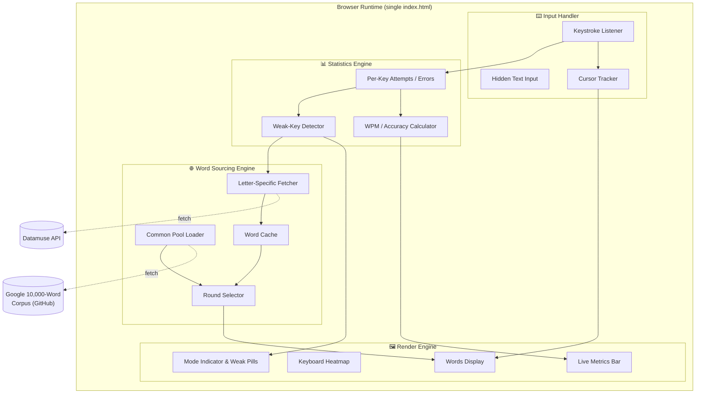
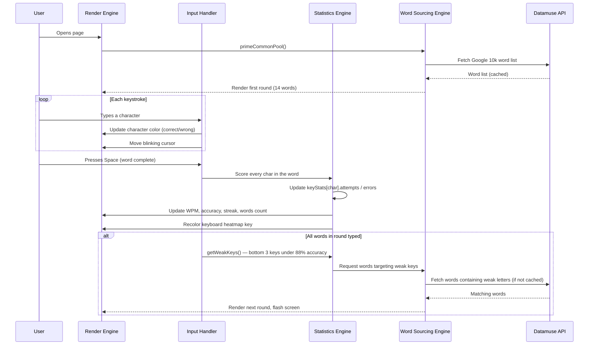
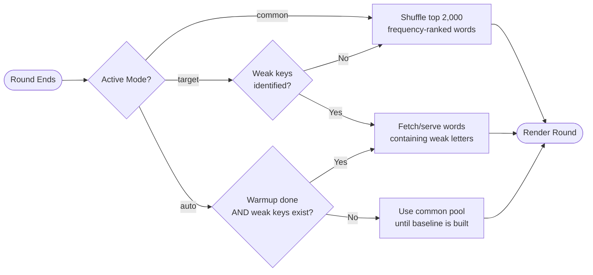
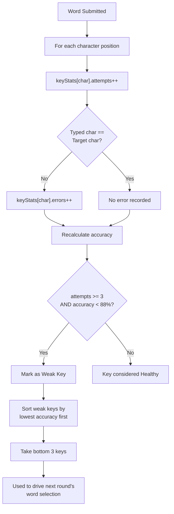
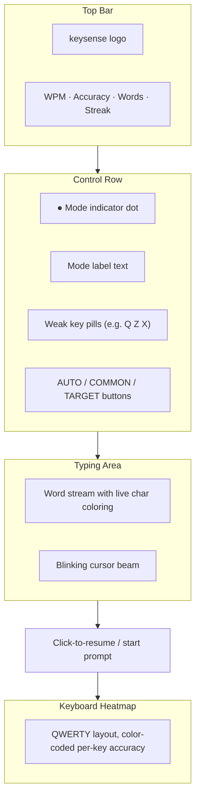

# ⌨️ keysense

**An adaptive typing trainer that learns where you struggle — and feeds you words to fix it.**

keysense is a single-file, zero-dependency typing practice tool that goes beyond static word lists. It tracks your accuracy on every key in real time, identifies your weakest keys, and automatically pulls real English words from a live dictionary API that are rich in those specific letters — turning every round into a targeted micro-drill.

---

## Table of Contents

1. [Overview](#1-overview)
2. [Key Features](#2-key-features)
3. [System Architecture](#3-system-architecture)
4. [How It Works](#4-how-it-works)
5. [Practice Modes](#5-practice-modes)
6. [The Weak-Key Detection Algorithm](#6-the-weak-key-detection-algorithm)
7. [Data Sources](#7-data-sources)
8. [User Interface Guide](#8-user-interface-guide)
9. [Project Structure](#9-project-structure)
10. [Configuration](#10-configuration)
11. [Getting Started](#11-getting-started)
12. [Browser Compatibility](#12-browser-compatibility)
13. [Known Limitations](#13-known-limitations)
14. [Credits & License](#14-credits--license)

---

## 1. Overview

Most typing trainers show you a fixed paragraph or a randomized word list and call it a day. **keysense** instead treats your typing session like a feedback loop: it constantly measures per-key accuracy, decides which keys are dragging you down, and — instead of guessing — queries the **Datamuse API** for real words that contain those problem letters. The result is a practice set that is statistically biased toward your actual weaknesses, refreshed every round.

It is built as a **single `index.html` file** with no build step, no framework, and no backend. Everything — UI rendering, input handling, statistics, caching, and API orchestration — runs in vanilla JavaScript directly in the browser.

---

## 2. Key Features

| Feature | Description |
|---|---|
| 🎯 **Adaptive targeting** | Continuously tracks accuracy per key and automatically rotates in words that exercise your three weakest keys. |
| 🔄 **Three practice modes** | `auto` (smart switching), `common` (frequency-based vocabulary), `target` (always drill weak keys). |
| 🌐 **Live word sourcing** | Fetches real, frequency-ranked English words from the Datamuse API and the Google 10,000-word corpus — no hardcoded word bank. |
| 🗺️ **Keyboard heatmap** | A QWERTY-shaped visual grid color-codes every letter by accuracy (great → good → ok → bad), pulsing red on problem keys. |
| 📊 **Live metrics** | Real-time WPM, accuracy %, words completed, and current correct-word streak, all updating per keystroke. |
| ⚡ **Smart caching & prefetching** | Words for each letter are cached after first fetch and silently pre-warmed in the background so practice never stalls on a network call. |
| 🖱️ **Minimal, distraction-free UI** | A dark, monospace, terminal-inspired interface with subtle animations (cursor blink, flash-on-round, pulsing weak-key pills). |
| 📱 **No installation needed** | Pure HTML/CSS/JS — open the file in any modern browser and start typing immediately. |

---

## 3. System Architecture

keysense is composed of four cooperating subsystems that all live inside one HTML document: the **Render Engine**, the **Input Handler**, the **Statistics Engine**, and the **Word Sourcing Engine**. They communicate through shared in-memory state (no global store/framework is used).



**Design philosophy:** there is no server and no database. All "intelligence" — caching, scoring, and word selection — happens client-side, in memory, for the duration of the page session. Closing or refreshing the tab resets all progress.

---

## 4. How It Works

At a high level, every typing round follows the same loop: **select words → render them → capture keystrokes → score accuracy → decide the next round's focus.**



### Step-by-step breakdown

1. **Initialization** — On page load, keysense fetches the Google 10,000-word English corpus (filtered to clean, 3–9 letter words) and builds the first practice round from the most frequent 2,000 words.
2. **Typing capture** — Keystrokes are captured through an invisible, off-screen `<input>` element (so mobile keyboards and IME work correctly), and every character is reflected onto styled `<span>` elements in real time — green for correct, red for incorrect, with a blinking cursor beam.
3. **Per-word scoring** — When the user presses **Space**, the just-typed word is compared character-by-character against the target word. Each character updates a global `keyStats` map of `{ attempts, errors }` for that letter.
4. **Live metrics update** — WPM (using the standard 5-characters-per-word convention), accuracy percentage, words completed, and streak are recalculated after every word and reflected instantly in the header.
5. **Keyboard heatmap update** — The corresponding key on the on-screen QWERTY heatmap recolors based on rolling accuracy for that letter (green tiers for good, red/pulsing for poor).
6. **Round end & re-selection** — Once all words in the round are typed, keysense determines the next round's word pool based on the active **mode** (see below) and the current weakest keys, fetching new words from Datamuse if they aren't already cached.
7. **Background pre-fetching** — Independently of the round loop, keysense quietly pre-fetches word lists for *every* letter of the alphabet a few seconds after load, staggered to avoid hitting rate limits — so that by the time a key becomes "weak," its word pool is often already cached.

---

## 5. Practice Modes

keysense ships with three selectable modes, switchable instantly via the pill buttons in the top control bar.



| Mode | Behavior |
|---|---|
| **`auto`** *(default)* | Runs a brief warm-up using common words to establish a baseline, then automatically switches into targeting mode once weak keys are detected — alternating intelligently as needed. |
| **`common`** | Always draws from the general frequency-ranked vocabulary pool, ignoring weak-key data. Good for general practice or testing raw speed. |
| **`target`** | Always tries to drill your three weakest keys, pulling in common words only as a filler if there isn't yet enough weak-letter data. |

---

## 6. The Weak-Key Detection Algorithm

This is the analytical core of keysense. After every word, character-level results feed into a running accuracy table for all 26 letters.



**Key parameters** (defined at the top of the script, easily tunable):

- `WEAK_THRESHOLD = 0.88` — any key with accuracy below 88% is considered weak.
- `MIN_ATTEMPTS = 3` — a key needs at least 3 recorded keystrokes before it can be flagged, preventing one early typo from skewing results.
- The **3 weakest** keys (by lowest accuracy) are selected at any given time, shown as red pills next to the mode indicator (e.g. `Q`, `Z`, `X`).

The keyboard heatmap uses four accuracy tiers for visual feedback: **great** (≥96%), **good** (≥90%), **ok** (≥82%), and **bad** (<82%, with a subtle red pulse animation to draw attention).

---

## 7. Data Sources

keysense intentionally avoids any hardcoded, hand-picked word list — every word the user types is sourced live from real linguistic data.

| Source | Purpose | Fallback |
|---|---|---|
| **Google 10,000 English Words** (`first20hours/google-10000-english`, hosted on GitHub raw) | Supplies the general/common word pool, pre-sorted by real-world frequency. Filtered to clean alphabetic words between 3–9 characters. | If unreachable, falls back to Datamuse topic queries, then to a small embedded static list as a last resort. |
| **Datamuse API** (`api.datamuse.com`) | Supplies words that *start with* or *contain multiple occurrences of* a specific weak letter, used to build targeted practice rounds. Results are frequency-sorted using Datamuse's `f:` frequency tag. | Returns an empty array on failure; the round selector then backfills with the common pool so practice never breaks. |

All fetched word lists are cached in memory per letter (`wordCache`) to minimize redundant network calls, with each letter's cache holding up to 60 words.

---

## 8. User Interface Guide



- **Top bar** — Shows the keysense wordmark and four live metrics: **WPM**, **Accuracy**, **Words typed**, and **Streak** (consecutive correctly-typed words). High-performing metrics are highlighted in the accent color (lime green) once they cross a threshold (e.g. WPM > 40, accuracy > 95%, streak > 5).
- **Mode row** — A pulsing dot and label show the current internal state (`warming up`, `targeting`, `common words`, etc.), alongside red pill badges for any currently-detected weak keys.
- **Mode switcher** — Three buttons (`AUTO`, `COMMON`, `TARGET`) let the user manually override the practice strategy at any time; switching modes immediately reloads the round.
- **Typing area** — Words wrap naturally across lines. Characters are colored dim (untyped), white (active), green (correct), or red (incorrect), with a blinking lime cursor beam tracking the current position.
- **Prompt line** — Displays contextual guidance ("click to begin," "click to resume") when the typing input loses focus.
- **Keyboard heatmap** — A miniature QWERTY layout beneath the typing area gives an always-visible, glanceable summary of per-letter accuracy across the whole session.
- **Flash overlay** — A very brief, subtle full-screen flash signals the transition between rounds.

---

## 9. Project Structure

keysense is deliberately a **single self-contained file** — there is no build pipeline, package manager, or external asset folder.

```
keysense/
└── index.html      # Everything: HTML structure, CSS styling, and JavaScript logic
```

Internally, the script is organized into clearly labeled sections (visible as comment banners in the source):

```
index.html
 ├─ <style>                  Visual design system (colors, layout, animations)
 └─ <script>
     ├─ CONFIGURATION        Tunable constants (round size, thresholds, etc.)
     ├─ KEYBOARD LAYOUT       QWERTY row definitions
     ├─ STATE                 In-memory session state
     ├─ DOM REFERENCES        Cached element lookups
     ├─ DATAMUSE FETCHER      API calls + Google 10k corpus loader
     ├─ KEYBOARD HEATMAP      Heatmap build/update logic
     ├─ WEAK KEY ANALYSIS     getWeakKeys() algorithm
     ├─ WORD SELECTION        pickWords() — mode-aware round builder
     ├─ MODE UI               Mode indicator + weak pill rendering
     ├─ RENDER                Word/character DOM rendering
     ├─ INPUT HANDLING        Keystroke capture & live scoring
     ├─ METRICS               WPM / accuracy / streak calculation
     ├─ ROUND MANAGEMENT      endRound() — round transition logic
     ├─ FOCUS                 Click-to-activate / blur handling
     ├─ UTILS                 Fisher-Yates shuffle, etc.
     ├─ MODE SWITCHING        switchMode() handler for UI buttons
     └─ INIT                  Bootstraps the app on load
```

---

## 10. Configuration

All tunable behavior lives in a single constants block near the top of the script — no need to hunt through the codebase to adjust difficulty or pacing.

| Constant | Default | Effect |
|---|---|---|
| `WORDS_PER_ROUND` | `14` | Number of words presented per round. |
| `CACHE_PER_LETTER` | `60` | Max words cached per letter from Datamuse. |
| `WARMUP_ROUNDS` | `1` | Rounds of common-word practice before `auto` mode starts targeting weak keys. |
| `WEAK_THRESHOLD` | `0.88` | Accuracy cutoff below which a key is considered "weak" (88%). |
| `MIN_ATTEMPTS` | `3` | Minimum keystrokes on a key before it can be evaluated for weakness. |

---

## 11. Getting Started

Since keysense has zero dependencies and no build step, running it is as simple as opening the file in a browser.

1. **Download or clone** the project so you have `index.html` locally.
2. **Open `index.html`** directly in any modern browser (double-click it, or drag it into a browser window).
   - Alternatively, serve it locally for a cleaner experience: `python3 -m http.server` from the project folder, then visit `http://localhost:8000`.
3. **Click anywhere in the typing area** (or just start typing) to begin the first round.
4. **Type the words shown**, pressing **Space** after each one to confirm and move to the next.
5. Watch the **keyboard heatmap** and **weak key pills** evolve as you type — keysense will start weaving in letter-specific words automatically once it has enough data.
6. Use the **AUTO / COMMON / TARGET** switcher at any time to change practice strategy.

> **Note:** keysense requires an active internet connection to fetch word lists from GitHub and the Datamuse API. If both are unreachable, it falls back to a small built-in word list so typing practice can still continue.

---

## 12. Browser Compatibility

keysense uses standard modern web APIs (`fetch`, ES6+ JavaScript, CSS Grid/Flexbox, CSS custom properties) and should run smoothly in any current version of Chrome, Firefox, Safari, or Edge. A touch-friendly hidden input ensures it also works on mobile browsers, though the experience is optimized for physical keyboards.

---

## 13. Known Limitations

- **No persistence** — All statistics (key accuracy, WPM history, streaks) live only in memory for the current page session. Refreshing or closing the tab resets everything.
- **Network-dependent** — Targeted word fetching relies on the Datamuse API and a GitHub-hosted word list; without internet access, the experience degrades to a small static fallback vocabulary.
- **Single-user, client-only** — There is no account system, leaderboard, or cross-device sync; this is intentionally a lightweight, local practice tool.
- **English only** — Word sourcing (Datamuse, Google 10k corpus) is English-specific; the QWERTY heatmap assumes a standard US keyboard layout.

---

## 14. Credits & License

- **Word corpus:** [Google 10,000 English Words](https://github.com/first20hours/google-10000-english) by first20hours (MIT-style, no-swears variant).
- **Word lookups:** [Datamuse API](https://www.datamuse.com/api/), a free word-finding query engine.
- **Fonts:** [DM Mono](https://fonts.google.com/specimen/DM+Mono) and [Syne](https://fonts.google.com/specimen/Syne) via Google Fonts.

This README documents the `index.html` implementation of **keysense** as a standalone, client-side typing trainer.
